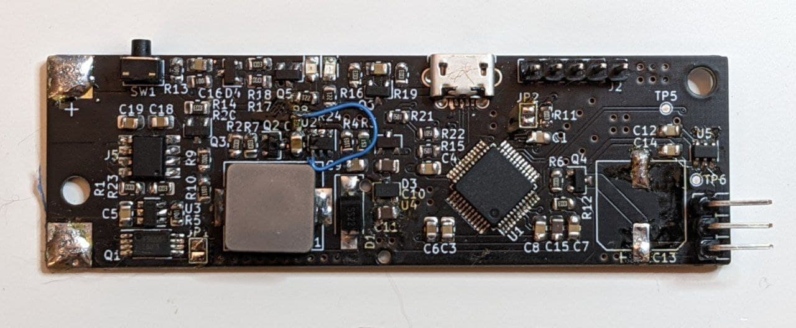

# ws28xx-led-driver

This is a straightforward DIY WS28xx LED driver. It's got these features:

- STM32F103C8T6 used as the microcontroller.
- Intended to be powered by a single-cell Li-ion battery, with USB charging and
  cell protection.
- 5V 1.5Aish step-up for LED power.
- Single button for soft-power and settings.
- 0805 SMD components or thereabouts.
